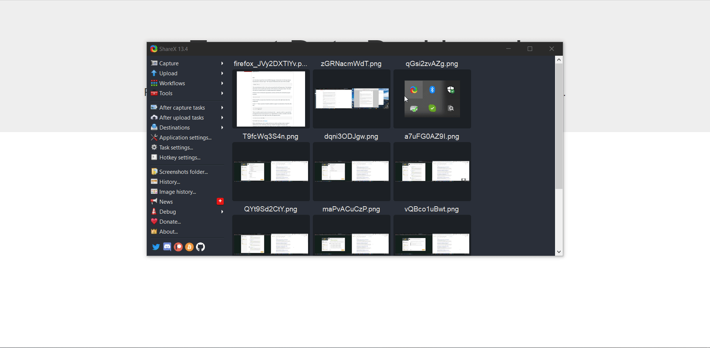

# Expert Data Dashboard

Another cool Data Science fellowship project which will work with datasets and visualization of them.

Working with DATA URLS the project idea is to easily get the URL parameters which contains a dataset. After reading the dataset to show a side navbar where user can see the columns name in dropdown format and have visualization for them changed dynamically. 

*** Note the project can read format or CSV format** *****

<h3> What is a URL Data? </h3>

**Data URLs**, **URLs** prefixed with the **data**: scheme, allow content creators to embed small files inline in documents. Note: **Data URLs** are treated as unique opaque origins by modern browsers, rather than  inheriting the origin of the settings object responsible for the  navigation. Read more <a href="https://help.data.world/hc/en-us/articles/115006114047-Adding-files-from-a-URL"> here</a>

<h5>Convert CSV to JSON or JSON to CSV: <a href="https://csvjson.com/"> here</a> </h5>

Datasets in URL format:

https://people.sc.fsu.edu/~jburkardt/data/csv/csv.html

https://support.spatialkey.com/spatialkey-sample-csv-data/

First look on the project:

